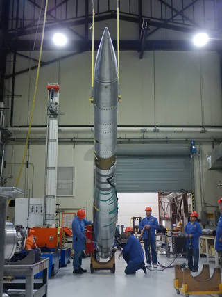

<a href="https://github.com/{{ site.github_username }}"><i class="fa fa-github"></i> GitHub</a> |
<a href="http://scholar.google.com/citations?user=-{{ site.gscholar_username }}&view_op=list_works&sortby=pubdate"><i class="fa fa-google"></i> Google Scholar</a> | 
<a href="{{site.ads_custom_search}}">Astrophysics Data System</a>

### An astronomer building space telescopes large and small -- with a focus on directly imaging  exoplanets: worlds around other stars
---
As a postdoctoral associate in Prof. Kerri Cahoy's [STAR Lab](http://starlab.mit.edu), part of  MIT's Dept. of Aeronautics and Astronautics, I am the payload engineer for the [DeMi CubeSat](https://dspace.mit.edu/handle/1721.1/114748) to test deformable mirrors in space and enable the next generation of exoplanet imaging space telescopes.

 |  
  -------------  | -------------
**PICTURE-B Payload CAD**        | **PICTURE-B Integration at White Sands Missile Range** (Courtesy NASA)

My [graduate work](https://open.bu.edu/handle/2144/19717 "PhD Dissertation PDF") in astronomy at Boston University focused on integrating,  relaunching, and understanding the <a title="PICTURE-B" href="https://www.nasa.gov/feature/picture-b-seeing-through-the-glare"> PICTURE-B sounding rocket</a>  mission which [demonstrated active wavefront sensing in space](https://arxiv.org/abs/1607.00277) - an essential technology for stabilizing space telescope optics enough to sense reflected light from exoplanets against the billion times brighter signal from their host stars.

 |  
  -------------  | -------------
**PICTURE-B Payload CAD**        | **PICTURE-B Integration at White Sands Missile Range** (Courtesy NASA)

(Read more in my dissertation, [Douglas 2016](https://open.bu.edu/handle/2144/19717)).

Other projects I have contributed to:

- building the <a href="http://ieeexplore.ieee.org/xpls/abs_all.jsp?arnumber=6352489">Dual-Wavelength Echidna Lidar </a>(DWEL),
- testing the detectors for the <a href="http://people.bu.edu/danowski/IMAGER/">Interstellar Medium Absorption Gradient Experiment Rocket </a>(IMAGER), 
- and inferring the density of the terrestrial ionosphere using observations from the  <a href="https://raids.nrl.navy.mil/">RAIDS</a>
(the Remote Atmospheric and Ionospheric Detection System) extreme ultraviolet spectrograph from the International Space Station.

Before graduate school, I worked at <a href="http://www.ligo-wa.caltech.edu/">LIGO Hanford Observatory</a>.

Many summers, I have a blast teaching the talented students at <a href="http://www.astronomycamp.org">Astronomy Camp</a>.

I am committed to enabling access to research tools through using open source programming languages and contributing to open source scientific libraries. Please find examples, such as  [Physical Optics Propagation in PYthon](http://ascl.net/1602.018), on my GitHub profile.

My scientific publications are listed on my Google Scholar Profile or the ADS:

[comment]: use font-awesome icons for social stuff:https://blog.r3bl.me/en/simple-social-media-links-jekyll/

 
<a href="https://github.com/{{ site.github_username }}"><i class="fa fa-github"></i> GitHub</a> |
<a href="http://scholar.google.com/citations?user=-{{ site.gscholar_username }}"><i class="fa fa-google"></i> Google Scholar</a> | 
<a href="{{site.ads_custom_search}}">Astrophysics Data System</a>

---

<a href="https://linkedin.com/in/{{ site.linkedin_username }}"><i class="fa fa-linkedin"></i> LinkedIn</a> | 
<a href="https://twitter.com/{{ site.twitter_username }}"><i class="fa fa-twitter"></i> Twitter</a>

<!-- Global Site Tag (gtag.js) - Google Analytics -->

